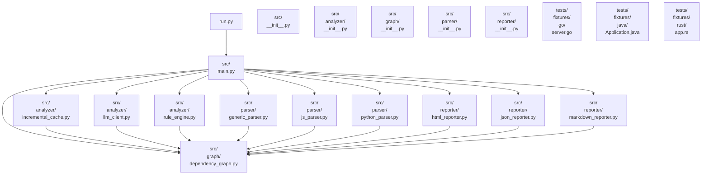

# 项目代码分析报告

> 自动生成于分析工具

---

## 项目概览

| 指标 | 数值 |
|------|------|
| 总文件数 | 20 |
| 总代码行 | 2150 |
| 总依赖关系 | 20 |

### 架构分层

| 层级 | 文件数 |
|------|--------|
| application | 1 |
| common | 9 |
| domain | 1 |
| foundation | 9 |

## 依赖关系图

## 文件详情

### `run.py`

- **语言**: python
- **代码行数**: 11
- **架构层级**: 应用层
- **功能描述**: 模块文件
- **分析来源**: static

- **依赖文件**: [`src/main.py`](#srcmainpy)

---

### `src/__init__.py`

- **语言**: python
- **代码行数**: 0
- **架构层级**: 基础层
- **功能描述**: (暂无)
- **分析来源**: static

---

### `src/analyzer/__init__.py`

- **语言**: python
- **代码行数**: 0
- **架构层级**: 基础层
- **功能描述**: (暂无)
- **分析来源**: static

---

### `src/analyzer/incremental_cache.py`

- **语言**: python
- **代码行数**: 84
- **架构层级**: 公共层
- **功能描述**: 定义类: IncrementalCache
- **分析来源**: static

- **依赖文件**: [`src/graph/dependency_graph.py`](#srcgraphdependencygraphpy)

- **被引用者**: `src/main.py`

---

### `src/analyzer/llm_client.py`

- **语言**: python
- **代码行数**: 106
- **架构层级**: 公共层
- **功能描述**: 定义类: LLMAnalyzer
- **分析来源**: static

- **依赖文件**: [`src/graph/dependency_graph.py`](#srcgraphdependencygraphpy)

- **被引用者**: `src/main.py`

---

### `src/analyzer/rule_engine.py`

- **语言**: python
- **代码行数**: 219
- **架构层级**: 公共层
- **功能描述**: 定义类: RuleViolation, RuleResult, RuleEngine
- **分析来源**: static

- **依赖文件**: [`src/graph/dependency_graph.py`](#srcgraphdependencygraphpy)

- **被引用者**: `src/main.py`

---

### `src/graph/__init__.py`

- **语言**: python
- **代码行数**: 0
- **架构层级**: 基础层
- **功能描述**: (暂无)
- **分析来源**: static

---

### `src/graph/dependency_graph.py`

- **语言**: python
- **代码行数**: 162
- **架构层级**: 基础层
- **功能描述**: 定义类: FileNode, DependencyGraph
- **分析来源**: static

- **被引用者**: `src/main.py`, `src/analyzer/incremental_cache.py`, `src/analyzer/llm_client.py`, `src/analyzer/rule_engine.py`, `src/parser/generic_parser.py`, `src/parser/js_parser.py`, `src/parser/python_parser.py`, `src/reporter/html_reporter.py` ...（共 10 个）

---

### `src/main.py`

- **语言**: python
- **代码行数**: 330
- **架构层级**: 领域层
- **功能描述**: 定义函数: load_config, scan_files, detect_language ...
- **分析来源**: static

- **依赖文件**: [`src/analyzer/incremental_cache.py`](#srcanalyzerincrementalcachepy), [`src/analyzer/llm_client.py`](#srcanalyzerllmclientpy), [`src/analyzer/rule_engine.py`](#srcanalyzerruleenginepy), [`src/graph/dependency_graph.py`](#srcgraphdependencygraphpy), [`src/parser/generic_parser.py`](#srcparsergenericparserpy), [`src/parser/js_parser.py`](#srcparserjsparserpy), [`src/parser/python_parser.py`](#srcparserpythonparserpy), [`src/reporter/html_reporter.py`](#srcreporterhtmlreporterpy) ...（共 10 个）

- **被引用者**: `run.py`

---

### `src/parser/__init__.py`

- **语言**: python
- **代码行数**: 0
- **架构层级**: 基础层
- **功能描述**: (暂无)
- **分析来源**: static

---

### `src/parser/generic_parser.py`

- **语言**: python
- **代码行数**: 228
- **架构层级**: 公共层
- **功能描述**: 定义类: GenericParser
- **分析来源**: static

- **依赖文件**: [`src/graph/dependency_graph.py`](#srcgraphdependencygraphpy)

- **被引用者**: `src/main.py`

---

### `src/parser/js_parser.py`

- **语言**: python
- **代码行数**: 171
- **架构层级**: 公共层
- **功能描述**: 定义类: JSParser
- **分析来源**: static

- **依赖文件**: [`src/graph/dependency_graph.py`](#srcgraphdependencygraphpy)

- **被引用者**: `src/main.py`

---

### `src/parser/python_parser.py`

- **语言**: python
- **代码行数**: 158
- **架构层级**: 公共层
- **功能描述**: 定义类: PythonParser
- **分析来源**: static

- **依赖文件**: [`src/graph/dependency_graph.py`](#srcgraphdependencygraphpy)

- **被引用者**: `src/main.py`

---

### `src/reporter/__init__.py`

- **语言**: python
- **代码行数**: 0
- **架构层级**: 基础层
- **功能描述**: (暂无)
- **分析来源**: static

---

### `src/reporter/html_reporter.py`

- **语言**: python
- **代码行数**: 394
- **架构层级**: 公共层
- **功能描述**: 定义类: HTMLReporter
- **分析来源**: static

- **依赖文件**: [`src/graph/dependency_graph.py`](#srcgraphdependencygraphpy)

- **被引用者**: `src/main.py`

---

### `src/reporter/json_reporter.py`

- **语言**: python
- **代码行数**: 32
- **架构层级**: 公共层
- **功能描述**: 定义类: JSONReporter
- **分析来源**: static

- **依赖文件**: [`src/graph/dependency_graph.py`](#srcgraphdependencygraphpy)

- **被引用者**: `src/main.py`

---

### `src/reporter/markdown_reporter.py`

- **语言**: python
- **代码行数**: 138
- **架构层级**: 公共层
- **功能描述**: 定义类: MarkdownReporter
- **分析来源**: static

- **依赖文件**: [`src/graph/dependency_graph.py`](#srcgraphdependencygraphpy)

- **被引用者**: `src/main.py`

---

### `tests/fixtures/go/server.go`

- **语言**: go
- **代码行数**: 35
- **架构层级**: 基础层
- **功能描述**: 定义类型: Server, Config
- **分析来源**: static

---

### `tests/fixtures/java/Application.java`

- **语言**: java
- **代码行数**: 43
- **架构层级**: 基础层
- **功能描述**: 定义类型: Application
- **分析来源**: static

---

### `tests/fixtures/rust/app.rs`

- **语言**: rust
- **代码行数**: 39
- **架构层级**: 基础层
- **功能描述**: 定义类型: App, AppMode, Runnable ...
- **分析来源**: static

---
