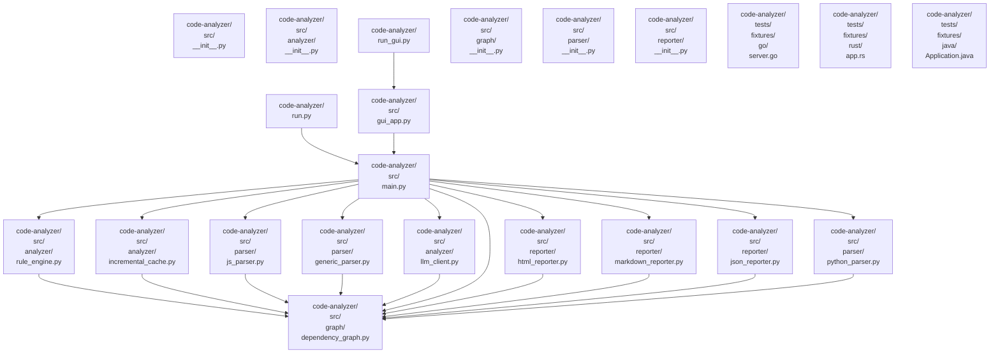

# 项目代码分析报告

> 自动生成于分析工具

---

## 项目概览

| 指标 | 数值 |
|------|------|
| 总文件数 | 22 |
| 总代码行 | 3800 |
| 总依赖关系 | 22 |

### 架构分层

| 层级 | 文件数 |
|------|--------|
| application | 2 |
| common | 9 |
| domain | 1 |
| foundation | 9 |
| interface | 1 |

## 依赖关系图

## 文件详情

### `code-analyzer/run.py`

- **语言**: python
- **代码行数**: 11
- **架构层级**: 应用层
- **功能描述**: 模块文件
- **分析来源**: static

- **依赖文件**: [`code-analyzer/src/main.py`](#code-analyzersrcmainpy)

---

### `code-analyzer/run_gui.py`

- **语言**: python
- **代码行数**: 11
- **架构层级**: 接口层
- **功能描述**: 模块文件
- **分析来源**: static

- **依赖文件**: [`code-analyzer/src/gui_app.py`](#code-analyzersrcguiapppy)

---

### `code-analyzer/src/__init__.py`

- **语言**: python
- **代码行数**: 0
- **架构层级**: 基础层
- **功能描述**: (暂无)
- **分析来源**: static

---

### `code-analyzer/src/analyzer/__init__.py`

- **语言**: python
- **代码行数**: 0
- **架构层级**: 基础层
- **功能描述**: (暂无)
- **分析来源**: static

---

### `code-analyzer/src/analyzer/incremental_cache.py`

- **语言**: python
- **代码行数**: 84
- **架构层级**: 公共层
- **功能描述**: 定义类: IncrementalCache
- **分析来源**: static

- **对外导出**: `class:IncrementalCache`

- **依赖文件**: [`code-analyzer/src/graph/dependency_graph.py`](#code-analyzersrcgraphdependencygraphpy)

- **被引用者**: `code-analyzer/src/main.py`

---

### `code-analyzer/src/analyzer/llm_client.py`

- **语言**: python
- **代码行数**: 106
- **架构层级**: 公共层
- **功能描述**: 定义类: LLMAnalyzer
- **分析来源**: static

- **对外导出**: `class:LLMAnalyzer`

- **依赖文件**: [`code-analyzer/src/graph/dependency_graph.py`](#code-analyzersrcgraphdependencygraphpy)

- **被引用者**: `code-analyzer/src/main.py`

---

### `code-analyzer/src/analyzer/rule_engine.py`

- **语言**: python
- **代码行数**: 219
- **架构层级**: 公共层
- **功能描述**: 定义类: RuleViolation, RuleResult, RuleEngine
- **分析来源**: static

- **对外导出**: `class:RuleViolation`, `class:RuleResult`, `class:RuleEngine`

- **依赖文件**: [`code-analyzer/src/graph/dependency_graph.py`](#code-analyzersrcgraphdependencygraphpy)

- **被引用者**: `code-analyzer/src/main.py`

---

### `code-analyzer/src/graph/__init__.py`

- **语言**: python
- **代码行数**: 0
- **架构层级**: 基础层
- **功能描述**: (暂无)
- **分析来源**: static

---

### `code-analyzer/src/graph/dependency_graph.py`

- **语言**: python
- **代码行数**: 167
- **架构层级**: 基础层
- **功能描述**: 定义类: FileNode, DependencyGraph
- **分析来源**: static

- **对外导出**: `class:FileNode`, `class:DependencyGraph`

- **被引用者**: `code-analyzer/src/analyzer/rule_engine.py`, `code-analyzer/src/analyzer/incremental_cache.py`, `code-analyzer/src/parser/js_parser.py`, `code-analyzer/src/parser/generic_parser.py`, `code-analyzer/src/analyzer/llm_client.py`, `code-analyzer/src/main.py`, `code-analyzer/src/reporter/html_reporter.py`, `code-analyzer/src/reporter/markdown_reporter.py` ...（共 10 个）

---

### `code-analyzer/src/gui_app.py`

- **语言**: python
- **代码行数**: 660
- **架构层级**: 应用层
- **功能描述**: 定义类: AnalysisWorker, ConfigCard, LogCard ...
- **分析来源**: static

- **对外导出**: `class:AnalysisWorker`, `class:ConfigCard`, `class:LogCard`, `class:SummaryCard`, `class:AnalyzerPage`, `class:SettingsPage`, `class:AboutPage`, `class:MainWindow`, `fn:main`

- **依赖文件**: [`code-analyzer/src/main.py`](#code-analyzersrcmainpy)

- **被引用者**: `code-analyzer/run_gui.py`

---

### `code-analyzer/src/main.py`

- **语言**: python
- **代码行数**: 419
- **架构层级**: 领域层
- **功能描述**: 定义函数: load_config, scan_files, detect_language ...
- **分析来源**: static

- **对外导出**: `var:SUPPORTED_EXTENSIONS`, `fn:load_config`, `fn:scan_files`, `fn:detect_language`, `fn:run_analysis`, `fn:generate_reports`, `fn:print_summary`, `fn:print_rule_result`, `fn:main`

- **依赖文件**: [`code-analyzer/src/analyzer/incremental_cache.py`](#code-analyzersrcanalyzerincrementalcachepy), [`code-analyzer/src/analyzer/llm_client.py`](#code-analyzersrcanalyzerllmclientpy), [`code-analyzer/src/analyzer/rule_engine.py`](#code-analyzersrcanalyzerruleenginepy), [`code-analyzer/src/graph/dependency_graph.py`](#code-analyzersrcgraphdependencygraphpy), [`code-analyzer/src/parser/generic_parser.py`](#code-analyzersrcparsergenericparserpy), [`code-analyzer/src/parser/js_parser.py`](#code-analyzersrcparserjsparserpy), [`code-analyzer/src/parser/python_parser.py`](#code-analyzersrcparserpythonparserpy), [`code-analyzer/src/reporter/html_reporter.py`](#code-analyzersrcreporterhtmlreporterpy) ...（共 10 个）

- **被引用者**: `code-analyzer/run.py`, `code-analyzer/src/gui_app.py`

---

### `code-analyzer/src/parser/__init__.py`

- **语言**: python
- **代码行数**: 0
- **架构层级**: 基础层
- **功能描述**: (暂无)
- **分析来源**: static

---

### `code-analyzer/src/parser/generic_parser.py`

- **语言**: python
- **代码行数**: 911
- **架构层级**: 公共层
- **功能描述**: 定义类: GenericParser
- **分析来源**: static

- **对外导出**: `var:LANG_CONFIG`, `var:LANG_EXPORT_PATTERNS`, `var:COMMENT_PATTERN`, `class:GenericParser`

- **依赖文件**: [`code-analyzer/src/graph/dependency_graph.py`](#code-analyzersrcgraphdependencygraphpy)

- **被引用者**: `code-analyzer/src/main.py`

---

### `code-analyzer/src/parser/js_parser.py`

- **语言**: python
- **代码行数**: 283
- **架构层级**: 公共层
- **功能描述**: 定义类: JSParser
- **分析来源**: static

- **对外导出**: `class:JSParser`

- **依赖文件**: [`code-analyzer/src/graph/dependency_graph.py`](#code-analyzersrcgraphdependencygraphpy)

- **被引用者**: `code-analyzer/src/main.py`

---

### `code-analyzer/src/parser/python_parser.py`

- **语言**: python
- **代码行数**: 241
- **架构层级**: 公共层
- **功能描述**: 定义类: PythonParser
- **分析来源**: static

- **对外导出**: `class:PythonParser`

- **依赖文件**: [`code-analyzer/src/graph/dependency_graph.py`](#code-analyzersrcgraphdependencygraphpy)

- **被引用者**: `code-analyzer/src/main.py`

---

### `code-analyzer/src/reporter/__init__.py`

- **语言**: python
- **代码行数**: 0
- **架构层级**: 基础层
- **功能描述**: (暂无)
- **分析来源**: static

---

### `code-analyzer/src/reporter/html_reporter.py`

- **语言**: python
- **代码行数**: 401
- **架构层级**: 公共层
- **功能描述**: 定义类: HTMLReporter
- **分析来源**: static

- **对外导出**: `class:HTMLReporter`

- **依赖文件**: [`code-analyzer/src/graph/dependency_graph.py`](#code-analyzersrcgraphdependencygraphpy)

- **被引用者**: `code-analyzer/src/main.py`

---

### `code-analyzer/src/reporter/json_reporter.py`

- **语言**: python
- **代码行数**: 32
- **架构层级**: 公共层
- **功能描述**: 定义类: JSONReporter
- **分析来源**: static

- **对外导出**: `class:JSONReporter`

- **依赖文件**: [`code-analyzer/src/graph/dependency_graph.py`](#code-analyzersrcgraphdependencygraphpy)

- **被引用者**: `code-analyzer/src/main.py`

---

### `code-analyzer/src/reporter/markdown_reporter.py`

- **语言**: python
- **代码行数**: 138
- **架构层级**: 公共层
- **功能描述**: 定义类: MarkdownReporter
- **分析来源**: static

- **对外导出**: `class:MarkdownReporter`

- **依赖文件**: [`code-analyzer/src/graph/dependency_graph.py`](#code-analyzersrcgraphdependencygraphpy)

- **被引用者**: `code-analyzer/src/main.py`

---

### `code-analyzer/tests/fixtures/go/server.go`

- **语言**: go
- **代码行数**: 35
- **架构层级**: 基础层
- **功能描述**: 定义类型: Server, Config
- **分析来源**: static

- **对外导出**: `fn:NewServer`, `class:Server`, `class:Config`

---

### `code-analyzer/tests/fixtures/java/Application.java`

- **语言**: java
- **代码行数**: 43
- **架构层级**: 基础层
- **功能描述**: 定义类型: Application
- **分析来源**: static

- **对外导出**: `class:Application`, `fn:login`, `fn:getAllUsers`, `fn:main`, `fn:run`

---

### `code-analyzer/tests/fixtures/rust/app.rs`

- **语言**: rust
- **代码行数**: 39
- **架构层级**: 基础层
- **功能描述**: 定义类型: App, AppMode, Runnable ...
- **分析来源**: static

- **对外导出**: `fn:create_app`, `class:App`, `class:AppMode`, `class:Runnable`, `mod:database`, `mod:handlers`

---
